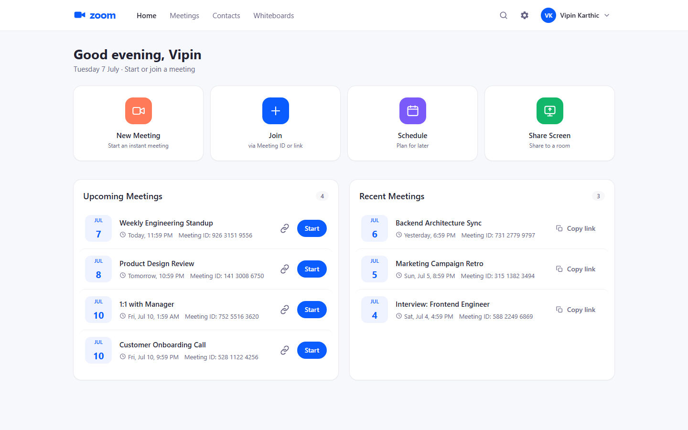

# Zoom Clone - Video Conferencing Platform

A functional clone of the Zoom web app that mirrors Zoom's look, feel and core
meeting workflows. You can start instant meetings, schedule meetings for later,
join by Meeting ID or invite link, and run a live meeting room with camera, mic,
chat, reactions, screen share, a waiting room and full host controls.



---

## Tech Stack

| Layer      | Technology                                                                            |
| ---------- | ------------------------------------------------------------------------------------- |
| Frontend   | **Next.js 14** (App Router, client-rendered SPA), **React 18**, **TypeScript**, **Tailwind CSS** |
| Backend    | **Python 3.12**, **FastAPI**, **SQLAlchemy 2.0**, **Pydantic v2**, **Uvicorn**        |
| Database   | **SQLite** (hand-designed schema, no ORM magic tables)                                |
| Real-time  | **WebRTC** peer-to-peer mesh (`RTCPeerConnection`) + a **FastAPI WebSocket** signalling hub |
| Auth       | **JWT** (PyJWT) + **bcrypt** password hashing + email **OTP** over SMTP               |

The only libraries beyond the core stack are small, standard helpers (PyJWT,
bcrypt, python-dotenv, python-dateutil on the backend; nothing beyond React/Next
on the frontend - the API client uses the native `fetch`).

---

## Features
- **Landing dashboard** - Zoom-style UI with a working navbar (Home / Meetings /
  Contacts / Whiteboards, search, settings, profile menu), quick-action tiles
  (New Meeting / Join / Schedule) and **Upcoming** + **Recent** meeting lists.
- **Instant meeting** - one click generates a unique 11-digit Meeting ID and a
  shareable invite link, and drops you into the room as host.
- **Join meeting** - join by **Meeting ID** *or* by pasting an **invite link**.
  A pre-join screen (device preview + name) validates the meeting exists first,
  with a clear "meeting not found" state otherwise.
- **Schedule meeting** - topic, description, date/time and duration. Stored in
  the DB, given a unique link, and listed under **Upcoming**.
- **Authentication** - email/password **login** and **OTP-verified signup**
  (a real 6-digit code is emailed via Gmail SMTP, with a dev fallback). Sessions
  are stateless **JWT Bearer** tokens; meetings are scoped to the signed-in user.
- **Guest join** - anyone with an invite link can join **without an account**;
  their name is automatically tagged **`(Guest)`** so they're easy to tell apart.
- **Responsive** - works on mobile, tablet and desktop.
- **Real-time meeting room** - genuine multi-peer **WebRTC** (people in different
  tabs/devices actually see and hear each other): live presence, mic/camera
  toggles, real-time chat, reactions and raise-hand, speaker/gallery views with
  pin, active-speaker highlight, in-meeting rename, and a meeting timer.
- **Faithful screen share** - the sharer keeps broadcasting their camera *and*
  the screen; everyone sees the screen large with a camera filmstrip on the side.
- **Full host controls / Security menu** (at creation and live in-meeting):
  waiting room, lock meeting, mute-on-entry, join-before-host, and "allow
  participants to" share / unmute / start-video / rename / chat / react; plus
  **mute-all**, **mute/remove** a participant, **spotlight**, **lower-hand**,
  **ask-to-unmute** and **end for all**.
- **Time-gated scheduling** - before the start time non-hosts see a countdown;
  the host can start early and then admits people from the waiting room.
- **Passcode-protected joins** - embedded in invite links, required for ID-only
  joins, host bypasses. The passcode is never leaked to non-hosts.
- **Profile & settings** - edit display name, avatar color and photo, a Personal
  Meeting ID (permanent room), change password, and preferences that drive the
  pre-join defaults (join muted, video-on-join, mirror, HD).

---

## Project Structure

```
scaler-task/
├── backend/                      # FastAPI + SQLite API
│   ├── app/
│   │   ├── main.py               # App entrypoint, CORS, startup
│   │   ├── config.py             # Env-driven config
│   │   ├── database.py           # Engine, session, declarative base
│   │   ├── models.py             # SQLAlchemy models (User, Meeting, Participant, PendingSignup)
│   │   ├── schemas.py            # Pydantic request/response schemas
│   │   ├── crud.py               # DB operations
│   │   ├── serializers.py        # ORM -> API DTO with computed fields
│   │   ├── security.py           # bcrypt + JWT + OTP hashing
│   │   ├── ratelimit.py          # In-memory rate limiter for auth endpoints
│   │   ├── emailer.py            # OTP email over SMTP (dev fallback)
│   │   ├── deps.py               # Auth dependencies (get_current_user)
│   │   ├── utils.py              # Meeting-number / passcode / invite-link generation
│   │   ├── seed.py               # Optional sample-data seeding
│   │   ├── ws.py                 # WebSocket signalling hub (WebRTC + presence + host controls)
│   │   └── routers/
│   │       ├── auth.py           # Signup (OTP), login, change password, current user
│   │       ├── meetings.py       # Meeting + participant + join endpoints
│   │       └── users.py          # Contacts, profile, preferences
│   ├── requirements.txt
│   ├── Procfile                  # Backend start command (Render / Railway)
│   └── .env.example
│
├── frontend/                     # Next.js app (App Router)
│   └── src/
│       ├── app/
│       │   ├── page.tsx                  # Dashboard
│       │   ├── login/page.tsx            # Email/password login
│       │   ├── signup/page.tsx           # OTP-verified signup
│       │   ├── meetings/page.tsx         # Meetings (Upcoming / Previous)
│       │   ├── contacts/page.tsx         # Coming soon
│       │   ├── whiteboards/page.tsx      # Coming soon
│       │   ├── settings/page.tsx         # Profile & preferences
│       │   ├── j/[number]/page.tsx       # Invite-link redirect
│       │   └── meeting/[number]/page.tsx # Live meeting room + pre-join
│       ├── components/                   # Navbar, AuthShell, modals, meeting UI, tiles
│       └── lib/
│           ├── api.ts                    # Fetch-based API client (+ JWT)
│           ├── auth.tsx                  # Auth context/provider
│           └── useMeeting.ts             # WebRTC mesh + signalling hook
│
├── docs/screenshots/             # README images
├── render.yaml                   # Render blueprint (builds from backend/)
└── README.md
```

---

## Database Schema

SQLite, four tables. `users` host `meetings`; each meeting has many
`participants`; `pending_signups` is transient state during OTP signup.

```
users 1 ── * meetings 1 ── * participants
                                   │
                          participants.user_id ─┐ (nullable, points back to users;
                                                └─ null = anonymous guest)
```

**`users`** - registered accounts (created only after OTP verification).

| Column                | Type        | Notes                                             |
| --------------------- | ----------- | ------------------------------------------------- |
| `id`                  | int PK      |                                                   |
| `name`                | str(120)    |                                                   |
| `email`               | str(200)    | unique                                            |
| `password_hash`       | str(200)    | bcrypt                                            |
| `is_verified`         | bool        | set once the email OTP is confirmed               |
| `avatar_color`        | str(9)      | hex color for the initials avatar                 |
| `avatar_url`          | text, null  | uploaded profile photo (data-URL), optional       |
| `pmi`                 | str(11)     | Personal Meeting ID - the user's permanent room   |
| `created_at`          | datetime    |                                                   |
| `pref_video_on_join`  | bool        | \                                                 |
| `pref_join_muted`     | bool        |  \  saved preferences that drive the              |
| `pref_mirror_video`   | bool        |  /  pre-join defaults                              |
| `pref_hd_video`       | bool        | /                                                 |
| `pref_notifications`  | bool        |                                                   |

**`meetings`** - instant or scheduled meetings, owned by a host.

| Column               | Type       | Notes                                              |
| -------------------- | ---------- | -------------------------------------------------- |
| `id`                 | str(36) PK | uuid4 hex                                          |
| `meeting_number`     | str(11)    | unique, indexed - the 11-digit Zoom-style ID       |
| `topic`              | str(200)   |                                                    |
| `description`        | text, null |                                                    |
| `passcode`           | str(10)    | required to join (host bypasses)                   |
| `host_id`            | FK users   | the owner/host                                     |
| `meeting_type`       | str(20)    | `instant` \| `scheduled`                           |
| `status`             | str(20)    | `scheduled` \| `active` \| `ended`                 |
| `waiting_room`       | bool       | \                                                  |
| `locked`             | bool       |  \                                                 |
| `mute_on_entry`      | bool       |   host-controlled settings / permissions           |
| `join_before_host`   | bool       |   (`allow_*` gate what non-hosts may do;            |
| `allow_screen_share` | bool       |    host always bypasses them)                      |
| `allow_unmute`       | bool       |  /                                                 |
| `allow_video`        | bool       | /                                                  |
| `allow_rename`       | bool       |                                                    |
| `allow_chat`         | bool       |                                                    |
| `allow_reactions`    | bool       |                                                    |
| `start_time`         | datetime, null | set for scheduled meetings                     |
| `duration`           | int        | minutes                                            |
| `created_at`         | datetime   |                                                    |

**`participants`** - join records per meeting (`ON DELETE CASCADE`).

| Column         | Type          | Notes                                                    |
| -------------- | ------------- | -------------------------------------------------------- |
| `id`           | int PK        |                                                          |
| `meeting_id`   | FK meetings   | cascade delete                                           |
| `user_id`      | FK users,null | null = anonymous guest (drives "one active meeting")     |
| `display_name` | str(120)      | guests get a `(Guest)` suffix                            |
| `is_host`      | bool          | decided server-side from the DB, never trusted from client |
| `is_muted`     | bool          |                                                          |
| `is_video_on`  | bool          |                                                          |
| `is_active`    | bool          | false = left/removed                                     |
| `admission`    | str(12)       | `admitted` \| `waiting` \| `denied`                      |
| `ws_token`     | str(40)       | per-participant secret; the WebSocket must present it    |
| `joined_at`    | datetime      |                                                          |

**`pending_signups`** - an unverified signup awaiting its OTP. Holds the name,
bcrypt password hash, the SHA-256 hashed OTP (`code_hash`), an `expires_at` and
an `attempts` counter. On successful verification it becomes a real `users` row
and is deleted.

---

## Getting Started (Local)

**Prerequisites:** Node.js 18+ and Python 3.10+.

### 1. Backend

```bash
cd backend
python -m venv .venv
# Windows:
.venv\Scripts\activate
# macOS/Linux:
# source .venv/bin/activate

pip install -r requirements.txt
cp .env.example .env          # works as-is for local dev (dev-mode OTP)
uvicorn app.main:app --reload --port 8000
```

The SQLite file (`zoomclone.db`) is created on first run. API runs at
`http://localhost:8000` (interactive docs at `/docs`).

**Seeded demo accounts** are created automatically on startup so you can log in
right away (no OTP needed) - all share the password **`demo1234`**:

| Name          | Email            | Password   |
| ------------- | ---------------- | ---------- |
| Vipin Karthic | `vipin@demo.dev` | `demo1234` |
| Demo1         | `demo1@demo.dev` | `demo1234` |
| Demo2         | `demo2@demo.dev` | `demo1234` |

Log into two of them in separate windows to test a real multi-peer meeting. You
can also create your own account via signup. (Set `SEED_SAMPLE_DATA=true` to also
seed a few sample meetings hosted by the first demo account.)

> **Dev-mode OTP (default):** with no `SMTP_PASS` set, the signup code is shown
> in the signup UI and printed to the backend console - no email setup needed.
> See *Authentication & Email* to send real emails.

### 2. Frontend

```bash
cd frontend
npm install
cp .env.example .env.local     # already points at http://localhost:8000
npm run dev
```

Open **http://localhost:3000**. Sign up (enter the OTP shown in dev mode), and
you're in.

> **Test a real multi-peer meeting:** sign in and start a meeting in one window,
> then open the invite link in a second (incognito) window and join as a
> **guest** - you'll see two live tiles, chat, reactions and host controls.

> **Camera/mic:** the room asks for camera & microphone permission. If denied,
> it falls back to an avatar tile and every other control still works.

---

## Environment Variables

**Backend** (`backend/.env`)

| Variable           | Default                              | Purpose                                          |
| ------------------ | ------------------------------------ | ------------------------------------------------ |
| `FRONTEND_URL`     | `http://localhost:3000`              | Used to build invite links                       |
| `CORS_ORIGINS`     | `http://localhost:3000,...`          | Allowed CORS origins                             |
| `SEED_SAMPLE_DATA` | `false`                              | `true` seeds a few sample meetings for the first user |
| `JWT_SECRET`       | *(dev default; set in prod)*         | Secret for signing JWTs                          |
| `JWT_EXPIRE_HOURS` | `168`                                | Token lifetime (7 days)                          |
| `SMTP_USER`        | `vipinkarthic17112005@gmail.com`     | Gmail sender for OTP emails                      |
| `SMTP_PASS`        | *(empty)*                            | Gmail **App Password**; empty = dev mode         |
| `SMTP_TIMEOUT`     | `15`                                 | SMTP socket timeout (seconds)                    |
| `OTP_TTL_MINUTES`  | `10`                                 | OTP validity window                              |

**Frontend** (`frontend/.env.local`)

| Variable               | Default                 | Purpose          |
| ---------------------- | ----------------------- | ---------------- |
| `NEXT_PUBLIC_API_BASE` | `http://localhost:8000` | Backend base URL |

---

## Authentication & Email

- **Login** is email + password; **signup** verifies email ownership with a
  6-digit **OTP** before creating the account. Passwords are **bcrypt** hashed;
  sessions are stateless **JWTs** sent as `Authorization: Bearer <token>` (so it
  works across a Vercel/Render cross-domain split without cookies).
- **Dev mode (default):** no SMTP password set - the OTP is shown in the signup
  UI and logged to the console. Zero setup.
- **Real email (Gmail SMTP):** set `SMTP_PASS` in `backend/.env` to a Gmail
  **App Password** (Google Account -> Security -> 2-Step Verification -> App
  Passwords, a 16-char code). OTPs are then delivered to the signup email.
- Login and OTP-request endpoints are **rate-limited** (per email) to slow
  brute-force and email-bombing.

---

## API Reference

Base URL `http://localhost:8000`; interactive docs at `/docs`. All `/api/*`
routes require a Bearer token except `GET /api/meetings/{number}` and
`POST /api/meetings/{number}/join`, which allow guests so invite links work.
In-meeting participant controls (mute/remove/spotlight/...) run over the
authenticated WebSocket, not REST.

| Method   | Endpoint                              | Description                                  |
| -------- | ------------------------------------- | -------------------------------------------- |
| `POST`   | `/auth/signup/request-otp`            | Start signup: email a 6-digit OTP            |
| `POST`   | `/auth/signup/resend-otp`             | Resend the signup OTP                        |
| `POST`   | `/auth/signup/verify`                 | Verify OTP -> create account + token         |
| `POST`   | `/auth/login`                         | Email/password login -> token                |
| `GET`    | `/auth/me`                            | Current authenticated user                   |
| `POST`   | `/auth/change-password`               | Change password (auth)                       |
| `GET`    | `/api/meetings/upcoming`              | Your scheduled, not-yet-ended meetings       |
| `GET`    | `/api/meetings/recent`                | Your past (ended) meetings                   |
| `GET`    | `/api/meetings`                       | All your meetings                            |
| `POST`   | `/api/meetings/instant`               | Create/reuse your instant meeting            |
| `POST`   | `/api/meetings/personal`              | Your Personal Meeting Room (PMI)             |
| `POST`   | `/api/meetings/schedule`              | Create a scheduled meeting                   |
| `GET`    | `/api/meetings/{number}`              | Validate / fetch a meeting (guest-visible)   |
| `PATCH`  | `/api/meetings/{number}`              | Edit a scheduled meeting (host)              |
| `DELETE` | `/api/meetings/{number}`              | Delete a meeting (host)                      |
| `PATCH`  | `/api/meetings/{number}/settings`     | Update host settings/permissions (host)      |
| `POST`   | `/api/meetings/{number}/end`          | End a meeting (host)                         |
| `POST`   | `/api/meetings/{number}/join`         | Join (guests allowed; creates a participant) |
| `GET`    | `/api/contacts`                       | Registered users (for the future directory)  |
| `PATCH`  | `/api/profile`                        | Update name / avatar color / photo           |
| `GET`    | `/api/preferences`                    | Read saved preferences                       |
| `PATCH`  | `/api/preferences`                    | Update preferences                           |
| `WS`     | `/ws/meetings/{number}`               | Signalling + presence/chat/reactions/host controls |

---

## Real-time Architecture

Media is peer-to-peer **WebRTC** - each pair of participants connects directly
with `RTCPeerConnection`. The FastAPI **WebSocket** hub only relays signalling
(SDP + ICE) and app events (presence, mic/video state, chat, reactions,
raise-hand, screen-share, and host controls). Host status and admission are
decided server-side from the DB; every WebSocket action is authenticated by a
per-participant `ws_token`, so host privileges can't be spoofed from the client.

A **mesh** is ideal for small meetings; a large call would use an SFU. STUN
(Google) handles most NATs; strict/enterprise or cross-network NATs would also
need a TURN server (not included).

---

## Deployment

**Frontend -> Vercel:** import the repo, set **Root Directory** to `frontend`,
add `NEXT_PUBLIC_API_BASE` = your backend URL, deploy.

**Backend -> Render / Railway:** new Web Service, **Root Directory** `backend`,
build `pip install -r requirements.txt`, start
`uvicorn app.main:app --host 0.0.0.0 --port $PORT` (a `Procfile` and
`render.yaml` are included). Set `FRONTEND_URL`, `CORS_ORIGINS`, a strong
`JWT_SECRET`, and `SMTP_PASS` for real email. The frontend derives the
signalling URL from `NEXT_PUBLIC_API_BASE` (`https` -> `wss`), so an HTTPS
backend works out of the box.

---

## Assumptions & Notes

- **Accounts vs guests** - the dashboard, meetings and settings are gated behind
  login. Invite links work for people **without** an account: they join straight
  from the pre-join screen and are tagged `(Guest)`.
- **Host model** - the meeting's creator is the host and bypasses the passcode.
  Host status is server-decided and enforced over an authenticated WebSocket, so
  it can't be spoofed. Participants are marked inactive on disconnect.
- **One active meeting per account** - "New Meeting" reuses your existing active
  instant room instead of creating duplicates, and a signed-in account can't be
  in two meetings at once. Guests aren't restricted.
- **Security** - all state-changing endpoints require auth; the passcode is never
  leaked to non-hosts (not even via the invite link); OTPs, passcodes and meeting
  numbers use a cryptographic RNG; and auth endpoints are rate-limited.
- **Times** are local wall-clock end-to-end, so a scheduled time shows exactly as
  picked. "Upcoming" = scheduled and not ended; "Recent" = ended.
- **Google OAuth** is intentionally not included - email/password + OTP keeps the
  system self-contained with no external OAuth credentials.
- **Original work** - the UI was rebuilt from scratch in Tailwind after studying
  Zoom's live site; no Zoom code or third-party clone repos were used.
